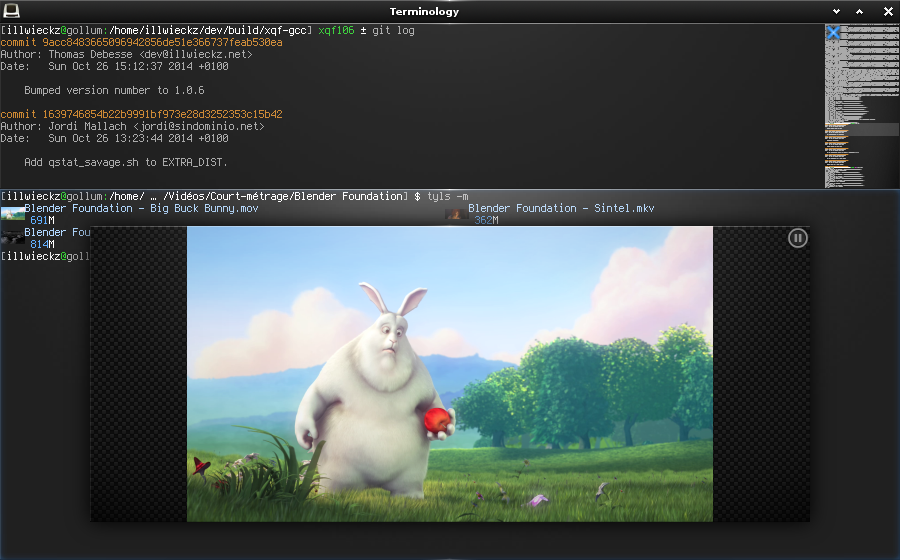
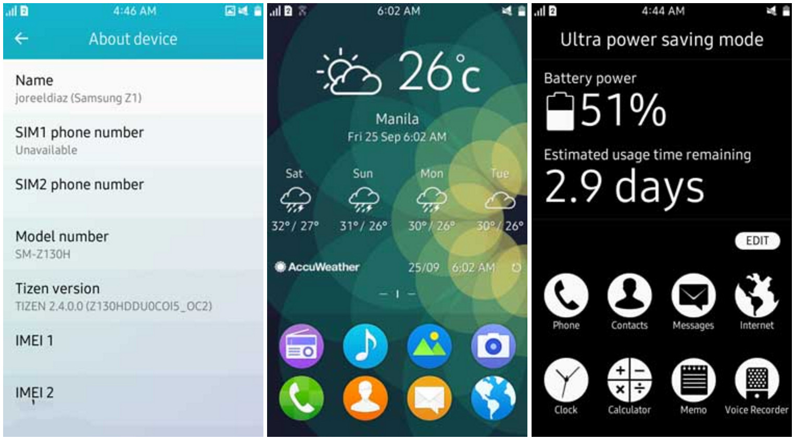

<!-- $theme: gaia -->
<link rel="stylesheet" type="text/css" href="../../themes/E/theme.css"></link>

<!-- template: invert -->

# Enlightenment, EFL & Tizen      Life beyond DR0.16

Andrew Williams

---

<!-- template: default -->

# Overview 

Enlightenment started as a window manager for Linux back in 1997.
Created by rasterman (rasterman.com) and developed by nearly 100 authors.

In 2000 work began on the next big release but many years later most folk assume it died. 

And yet it lives...

---

# TL;DR

 
 
 
 

    From 3rd most popular Linux desktop to nowhere
    and back to millions of devices through mobile & IoT

---

<!-- template: invert -->

# Enlightenment

---

<!-- template: default -->

# Enlightenment (Desktop)

* Pioneering desktop environment
* Multiple, virtual & xinerama desktops
* Beautiful themes
* Plugins & scripts
* Highly configurable

Also on tablet and initial work for mobile devices

---

  

---

# Timeline

1997: Enlightenment 0.1 launched
1997: 0.13 released
...
1999: 0.16 released
2000: work begins on 0.17
...
2003: SlashDot 1.0 April fool
...
**2012**:  0.17 finally released
2013: 0.18 released

And then every 12 months

---

<!-- template: invert -->

# Enlightenment Foundation Libraries

---

# EFL

<!-- template: default -->

### (Enlightenment Foundation Libraries)

Many different libraries (around 25)

* Evas
* Ecore\_X Ecore\_Wayland
* Edje
* Eo
* Elementary

---

<!-- template: normal -->

# Applications (> 25)

### Enlightenment

The main usage of the EFL - obviously - now bigger, better, faster and more themeable than ever.

### Terminology

Our terminal emulator with a real Enlightenment swing. Inline images, themes, background videos.

### Rage

Rage is a video and audio player written with EFL with some extra bells and whistles.

### Edi

Complete IDE for Enlightenment and EFL development - a work in progress.

---

   

---

<!-- template: invert -->

# Tizen

---

<!-- template: default -->

# Tizen (Mobile / IoT)

A Samsung, Intel, LG (and others) backed inititive to build an IoT stack on Linux.
Currently a large part of Samsung product lineup including:

* Smart phones
* TVs
* Watches
* Fridges
* Digital Cameras

---

   

---

# Getting Enlightenment

## Packages or Download

https://phab.enlightenment.org/w/packaging_status/
https://www.enlightenment.org/download

## Git

https://git.enlightenment.org/

## Efler

http://bit.ly/efler

Many packages use bleeding edge git master
\- but it is stable enough for day to day usage!

---

# Questions?

* @\_Enlightenment\_
* @ajwillia_ms
* #e - irc.freenode.net
* www.enlightenment.org

 

* andy@fossfi.sh
* http://ajwillia.ms

